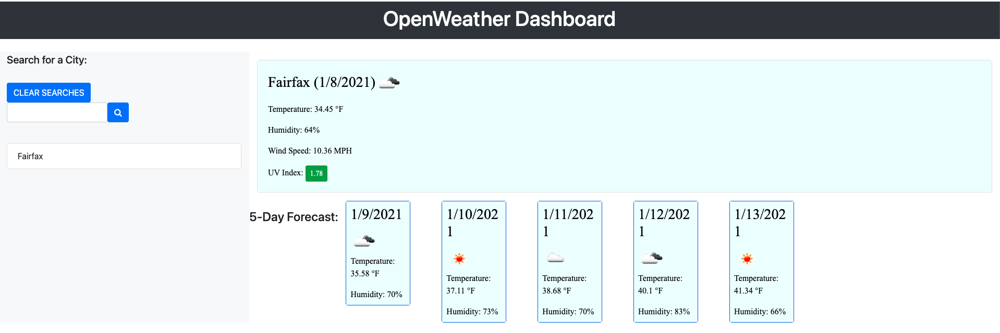

# 06 Server-Side APIs: Weather Dashboard

## Deployed App
https://anasm23.github.io/WeatherDashboard/

## Description
This application displays the weather conditions for the user searched city, showing both the 5 day forecast and current forecast. Additionally, Humidity, Wind Speed and UV Index are displayed. Each search is stored locally. Past searches can be accessed easily from the list displayed under the search bar. 

Using the OpenWeather API, data is retrieved and displayed showing a 5-day Forecast and current day weather statistics. 

Using AJAX, the OpenWeather api retrieves data in JSON format. The application dynamically updates with JQuery.

## Screenshot


## Code Snippet
```
function weatherFunction(searchTerm) {

        $.ajax({
            type: "GET",
            url: "https://api.openweathermap.org/data/2.5/weather?q=" + searchTerm + "&appid=ba465d36d563ab2554496783400dba83&units=imperial",


        }).then(function (data) {
            if (history.indexOf(searchTerm) === -1) {
                history.push(searchTerm);
                localStorage.setItem("history", JSON.stringify(history));
                createRow(searchTerm);
            }
            $("#today").empty();
```


## Technologies used
* Javascript
* Openweather API
* HTML/CSS

